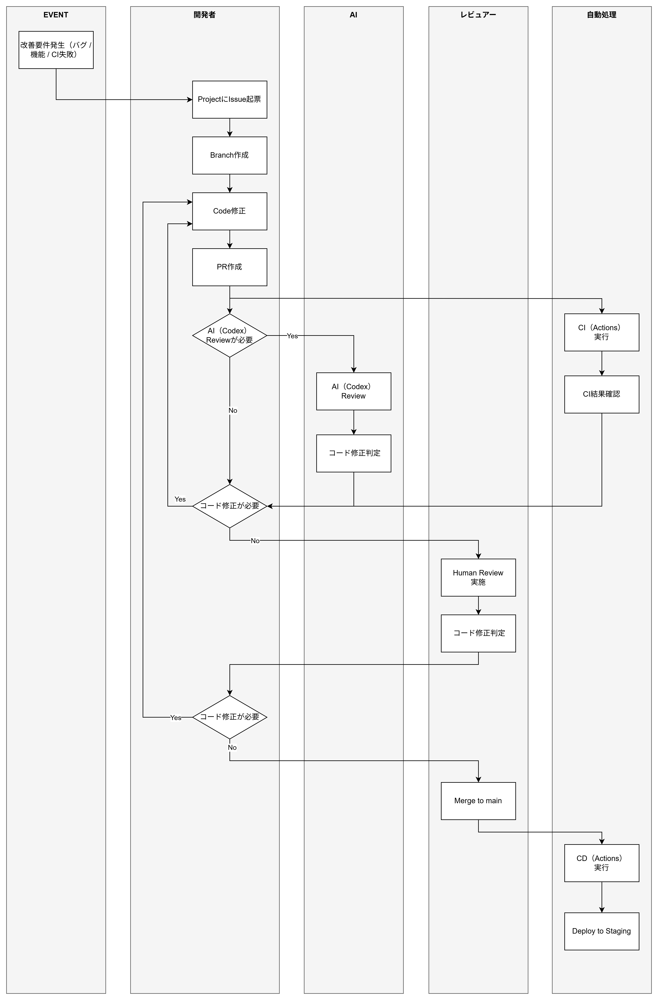
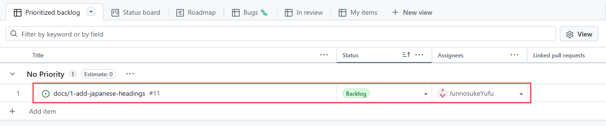
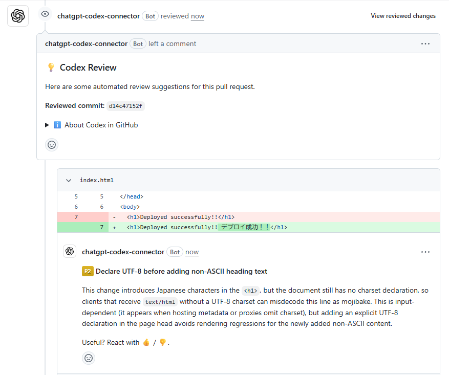
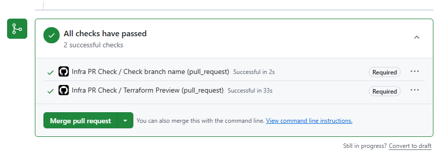
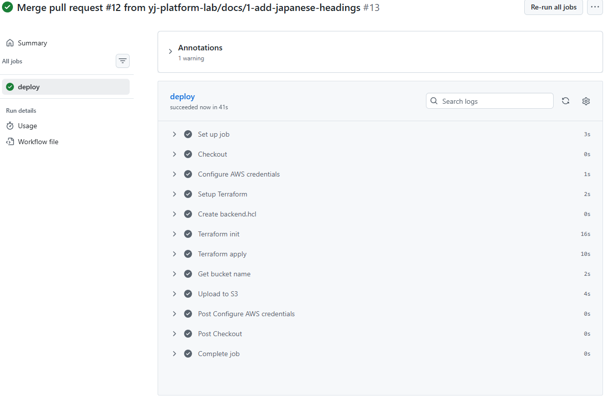
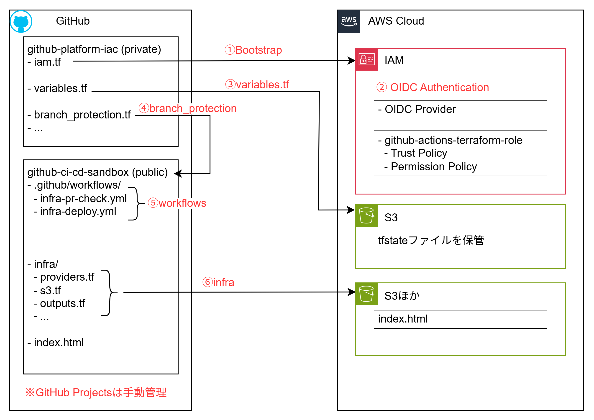

# GitHub ActionsとTerraformでPRベースのCI/CD運用を構築する

## Background

TerraformによりAWSおよびGitHubの構築はコード化しているが、GitHub上の運用（Issue / PR / Actions）およびインフラ変更のCI/CDフローは体系化されていなかった。そのため、個人環境であっても業務運用に耐えるGitHub設計と、Terraformを用いたインフラCI/CDの仕組みを定義する。

## Operation Flow

本構成では、設計を先に定義するのではなく、運用フローを起点として設計を行った。
一般的にシステム設計では、要件定義から順に構成を積み上げるアプローチが取られることが多い。しかし、運用を担当する中で、実際の作業フローと乖離した設計は定着せず、形骸化しやすいという課題を感じていた。

そのため、本検証では先に理想的な運用フロー（Issue → PR → CI → Review → Merge → Deploy）を定義し、その運用を成立させるために必要な構成要素を逆算する形で設計を行った。

本構成では、Terraformによるインフラ変更をGitHub Actionsで自動化する。CIではTerraform planにより変更差分を確認し、CDではTerraform applyによりStaging環境へ変更を反映する。インフラ変更を手動運用に依存すると、変更履歴の不透明化や設定ミスのリスクが高まる。そのため、CI/CDを適用することで、変更の可視化・再現性・レビュー可能性を担保する。

なお、本検証では運用フローの検証を主目的としているため、本番環境への適用は対象外とし、Staging環境への反映までをスコープとする。



## Actual Operation

本構成では、Issueを起点として変更管理を行う。
開発者はIssueに対応するfeature branchを作成し、Terraformコードを修正する。変更後はPull Requestを作成し、GitHub ActionsによるCIを実行する。

CIでは以下を自動実行する。

- branch naming check
- terraform fmt
- terraform validate
- terraform plan

これにより、構文エラーや想定外の差分をPull Request段階で検知する。
また、必要に応じてCodexによるAIレビューを実施する。本構成ではAIレビューを必須とはせず、変更内容に応じて任意で実施する運用とした。
レビュー完了後、mainへmergeすることでCDが実行され、Terraform applyによってStaging環境へ変更が反映される。

図：github-ci-cd-sandboxにissueを起票し、projectと紐づける



図：AI(codex)によるレビュー



図：CI（GitHub Actions）実行画面。



図：merge実施時（CD自動実行）



## Operation Requirements

Operation FlowとActual Operationから導出した要件は以下とする。

- PR作成時に自動CIを実行できること
→ infra-pr-check.ymlを作成し、pull_requestを契機に実行する
- main merge後に自動CDを実行できること
→ infra-deploy.ymlを作成し、mainブランチへのpushを契機に実行する
- AWS Access KeyをGitHubに保存しないこと
→ GitHub OIDC ProviderとIAM Roleを作成し、一時クレデンシャルでAWSへ接続する
- Terraform stateをGitHub Actions実行間で永続化できること
→ S3 backendを使用し、tfstateをリモート保存する
- backend設定をpublic repositoryへ保存しないこと
→ GitHub Variablesを利用し、workflow実行時にbackend.hclを動的生成する
- CI/CD実行主体の権限を制限できること
→ IAM RoleのPermission Policyで操作対象を限定する
- 認証基盤をpublic repoから分離できること
→ OIDC Provider / IAM Roleはprivateなgithub-platform-iacで管理する
- ブランチ戦略はIssue起点とすること
→ Pull Request時に「ブランチ名へIssue番号を含めること」を要件とする
- Pull RequestとIssueを関連付けられること
→ PR本文にIssueリンク（Closes #xx）を含める運用とする
- Issueを一覧管理できること
→ Issueはrepository単位で管理し、Organization Projectへ紐付けて横断管理する
- GitHub Projectsを柔軟に運用できること
→ GitHub ProjectsはTerraform管理対象外とし、GUIによる手動管理とする
- mainブランチを常に安定状態に保つこと
→ mainへの直接push禁止（管理者含む）
→ Pull Request必須
→ GitHub Actions成功必須
→ Human Review必須
→ マージ後ブランチ自動削除
- GitHub Actions実行前に必要となる認証基盤を事前作成できること
→ OIDC Provider / IAM RoleはGitHub Actions実行前提となるため、privateなgithub-platform-iacからローカルTerraform applyで事前作成する
- 必要に応じてAIレビューを実施できること
→ @codex reviewによるAIレビューを任意実行できる構成とする

## Repository Structure

以下に本構成で使用するrepositoryおよび主要ファイルを示す。



①はBootstrap用IAMリソースである。

OIDC Provider / IAM RoleはGitHub Actions実行前に存在している必要がある。そのため、github-ci-cd-sandbox側で管理すると「GitHub Actionsで認証するためのIAMをGitHub Actionsで作成する」という鶏卵問題が発生する。このため、認証基盤はprivate repositoryであるgithub-platform-iac側で事前作成する構成とした。

---

②ではGitHub Actions用OIDC Providerを作成している。
OIDC Providerでは、GitHubが提供するIssuer URLとAWS STSをAudienceとして設定する。またTrust Policyでは、github-ci-cd-sandbox repositoryから発行されたTokenのみ許可している。Permission Policyでは、GitHub Actionsが実行可能なAWS操作を必要最小限に制限している。なお、2026/5/5時点ではthumbprint設定は不要となっている。

```
https://github.com/aws-actions/configure-aws-credentials/tree/main
```

---

③のvariables.tfでは、Terraform backend設定をGitHub Actions Variablesとして管理している。backend.hclをpublic repositoryへ直接配置したくないためである。

---

④のbranch_protection.tfでは、github-ci-cd-sandbox repositoryへブランチ保護を適用している。
enforce_admins = trueにより、管理者を含めたmain branchへの直接pushを禁止している。
本来はPull Request必須 + Human Review必須としたいが、現時点では単一ユーザ運用のため required_approving_review_count = 0 としている。

---

⑤はCI/CD用GitHub Actions workflowである。
infra-pr-check.ymlでは、branch name checkで命名規則確認を行う。Terraform Previewでは terraform init / fmt / validate / plan を実行し、Terraform適用前に構文・差分確認を行う。infra-deploy.ymlはCD用workflowであり、main branchへのmergeを契機として実行される。

---

⑥はTerraformで構築するS3 Static Website用リソースである。
今回はCI/CD動作確認を目的としているため、index.htmlは最小構成としている。

## Summary

今回の検証では、TerraformやGitHub Actions単体ではなく、PR運用・認証・レビュー・権限制御まで含めたCI/CD運用全体を設計対象とした。
特に、OIDC認証のBootstrap問題やBranch Protection / Required Checksなど、実際に運用を成立させるための周辺設計で多くの学びがあった。
また、運用フローを先に定義し、そこから必要要件を逆算することで、GitHub運用・認証・CI/CDを一貫した構成として整理できた。

##